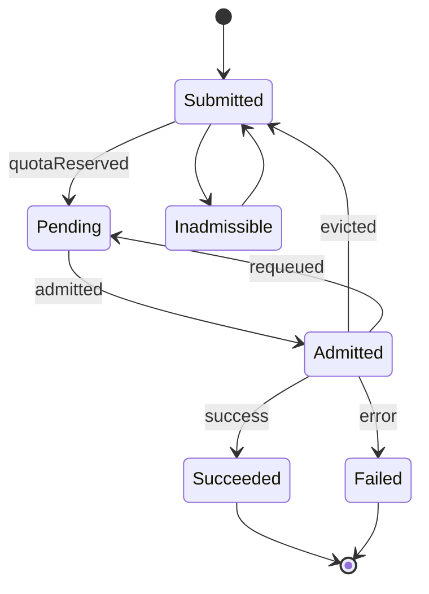

# Kueue workload lifecycle

## State Diagram

## Kueue Conditions

| Transition                   | Type            | Reason         | Success | Description                                                                                            |
| ---------------------------- | --------------- | -------------- | ------- | ------------------------------------------------------------------------------------------------------ |
| `Submitted --> Inadmissible` | `QuotaReserved` | `Inadmissible` | `False` | Workload was not admitted to the cluster (missing/stopped local queue, missing/inactive cluster queue) |
| `Submitted --> Pending`      | `QuotaReserved` | `???`          | `True`  | Workload was admitted to a cluster queue                                                               |
| `Pending --> Admitted`       | `Admitted`      | `???`          | `True`  | Workload was admitted for execution                                                                    |
| `Admitted --> Succeeded`     | `Finished`      | `Succeeded`    | `True`  | Workload completed successfully                                                                        |
| `Admitted --> Failed`        | `Finished`      | `Failed`       | `False` | Workload completed with an error                                                                       |
| `Admitted --> Pending`       | `Evicted`       | `Preempted`    | `True`  | Workload was preempted by another workload and removed from the queue                                  |
| `Admitted --> Submitted`     | `Requeued`      | `Preempted`    | `True`  | Workload was preempted by another workload and requeued                                                |

## Definitions

<dl>
<dt>Submission timestamp</dt>
<dd>The time at which the Kueue workload resource was created.</dd>

<dt>Admission timestamp</dt>
<dd>The time at which the Kueue workload was last admitted for execution.</dd>

<dt>Termination timestamp</dt>
<dd>The time at which the Kueue workload has entered a terminal state.</dd>
</dl>
